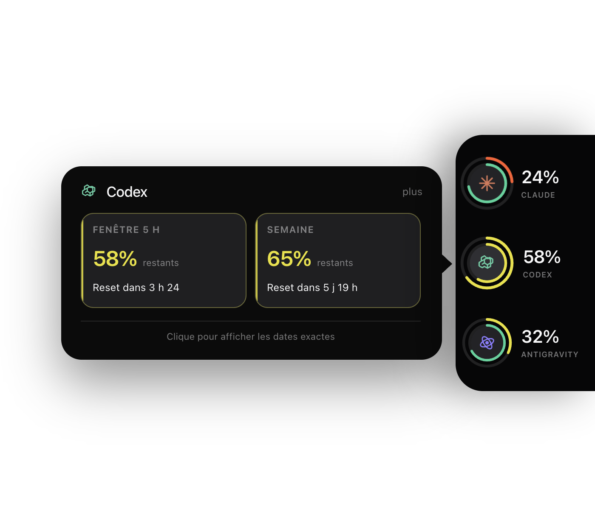
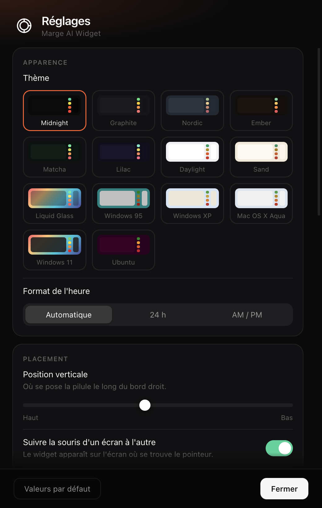

# Marge AI Widget

Les quotas Claude, Codex et Antigravity au bord droit de l’écran.

Approche la souris du bord : le widget glisse sans prendre le focus. Éloigne-la : il disparaît. Trois services, toujours au même endroit, même quand l’un d’eux ne communique pas temporairement ses limites.



## Lecture immédiate

- Anneau intérieur : fenêtre courte, normalement 5 heures.
- Anneau extérieur : fenêtre hebdomadaire.
- Chiffre à droite : pourcentage restant de la limite la plus contraignante du service.
- Anneau pointillé : limite non communiquée, jamais transformée en faux zéro.
- Survol : détail de la source sélectionnée.
- Clic : dates et heures exactes de réinitialisation ; reclique pour réduire.

Claude peut exposer des limites hebdomadaires spécifiques à certains modèles. Antigravity sépare les groupes Gemini et Claude/GPT. Le chiffre principal prend toujours la valeur réellement la plus contraignante ; le panneau explique laquelle.

## Installation depuis une copie locale

Prérequis : macOS 13+ ou Linux X11, et Node.js 22.12 ou plus récent.

```sh
git clone https://github.com/YannickLanteri/marge-ai-widget.git marge-ai-widget
cd marge-ai-widget
bash install.sh --local
```

L’installateur crée atomiquement un snapshot dans `~/.marge-ai-widget`, installe uniquement le runtime Electron verrouillé, exécute tous les tests, active le démarrage automatique puis lance le widget. En cas d’échec, l’installation précédente reste intacte.

Commandes utiles :

```sh
marge
marge status
marge logs
marge stop
```

Pour mettre à jour un snapshot local, relance `bash install.sh --local`. Une installation distante conservant son historique git propose également `marge update`.

Désinstallation :

```sh
bash ~/.marge-ai-widget/uninstall.sh
```

Les réglages sont conservés par défaut. Ajoute `--purge` pour retirer aussi les réglages et caches du widget. Les sessions Claude, Codex et Antigravity ne sont jamais supprimées.

## Sources des quotas

### Claude

Le widget lit la session Claude Code depuis le Trousseau macOS ou `~/.claude/.credentials.json`, puis appelle uniquement :

```text
GET https://api.anthropic.com/api/oauth/usage
```

Il ne renouvelle ni ne stocke jamais le jeton. Sur macOS, une erreur d’authentification
affiche un bouton **Connecter Claude** qui ouvre le Terminal sur la commande fixe
`claude auth login`. Claude Code reste seul responsable de sa session et de son renouvellement.

### Codex

Le widget lance ponctuellement le App Server officiel installé avec Codex et lit :

```text
account/rateLimits/read
```

Codex reste propriétaire de l’authentification et du renouvellement des jetons. Aucun fichier `auth.json` n’est lu par le widget. Les comptes configurés uniquement avec une clé API n’exposent pas les quotas d’abonnement ChatGPT.

Une fenêtre absente de la réponse officielle reste absente dans l’interface. Cela couvre notamment les comptes qui ne reçoivent temporairement que la limite hebdomadaire.

### Antigravity

Le widget détecte le processus Antigravity appartenant à la session locale et interroge son service sur `127.0.0.1`. Le jeton CSRF local reste en mémoire et n’est ni écrit ni journalisé.

Antigravity doit être ouvert pour que ses quotas soient lisibles.

## Confidentialité

- Aucun analytics ni télémétrie.
- Aucun jeton copié ou stocké.
- Claude communique uniquement avec `api.anthropic.com`.
- Codex communique par son App Server officiel.
- Antigravity est interrogé uniquement en local.
- Les journaux contiennent des pourcentages et des états, jamais des identifiants secrets.

## États et rafraîchissement

La lecture se fait toutes les cinq minutes par défaut. Le rythme ralentit quand la machine est inactive et respecte les réponses de limitation. Après une erreur, la dernière vraie valeur peut rester visible pendant 24 heures avec la mention « dernière lecture ». Une valeur de démonstration n’est jamais persistée.

Configuration : `~/.config/marge-ai-widget/config.json`. Les anciens réglages de `~/.config/claude-marge` sont copiés une seule fois pour assurer la compatibilité.

```json
{
  "verticalAnchor": 0.45,
  "refreshSeconds": 300,
  "followCursorDisplay": true,
  "alertAt": [80, 95],
  "shortcut": "CommandOrControl+Shift+M",
  "theme": "midnight",
  "timeFormat": "auto",
  "displayId": "primary"
}
```

Quatorze thèmes sont inclus. Le raccourci épingle la pastille ; le panneau détaillé continue de suivre le pointeur.



## Développement

```sh
npm ci
npm run electron:ensure
npm test
npm run check
npm run demo
MARGE_DEMO=1 MARGE_CAPTURE=/tmp/marge-ai.png npm run demo
npm run usage
npm run dist:mac
```

La suite couvre les limites de configuration, l’installateur, les journaux bornés, la géométrie multi-écrans, les trois fournisseurs, les fenêtres absentes, la persistance, le backoff, les alertes, les langues, les thèmes et les mises à jour. La CI capture aussi le vrai widget Electron et sa fenêtre de réglages.

Les paquets locaux ne sont pas signés. Les binaires macOS publics devront être signés et notarisés avant diffusion.

## Sécurité

Le sandbox des renderers, l’isolation de contexte, les CSP restrictives, le blocage de la navigation et le refus des permissions navigateur maintiennent les sessions fournisseurs hors de l’interface. Les builds packagés imposent aussi l’intégrité ASAR et désactivent RunAsNode, l’injection par variables Node et l’inspection CLI. Les fichiers d’état sont écrits atomiquement avec des permissions réservées à l’utilisateur. Consulte [SECURITY.md](SECURITY.md) pour signaler une vulnérabilité en privé.

## Compatibilité

- macOS 13+ Intel et Apple Silicon : pris en charge.
- Linux X11 : pris en charge.
- Linux Wayland : partiel, Electron ne garantit pas le placement global.
- Windows : non pris en charge par le positionnement du widget.

## Licence

[MIT](LICENSE). Projet non officiel, sans affiliation avec Anthropic, OpenAI ou Google. Le travail Claude Marge original reste crédité par l’historique git et la licence ; les éléments dérivés d’AG Usage sont crédités dans [THIRD_PARTY_NOTICES](THIRD_PARTY_NOTICES).
