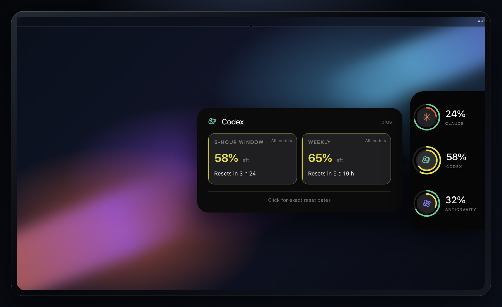
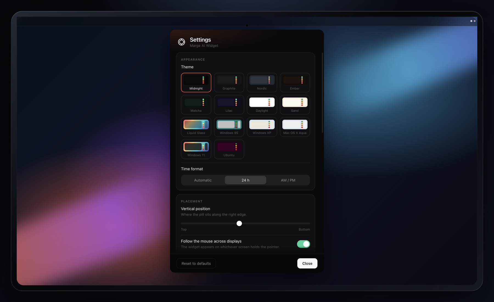

<p align="center">
  
</p>

<h1 align="center">Marge AI Widget</h1>

<p align="center">Les quotas Claude, Codex et Antigravity au bord droit de l’écran.</p>

<p align="center">
  <a href="https://github.com/YannickLanteri/marge-ai-widget/actions/workflows/test.yml"></a>
  · <a href="LICENSE">Licence MIT</a>
  · Electron 44.0.0
  · <a href="README.md">English</a>
</p>



Approche le pointeur du bord extérieur droit : le widget glisse sans prendre le focus. Éloigne-le et il disparaît. Le survol affiche le détail du fournisseur ; un clic montre les dates exactes de réinitialisation.

Le bureau ci-dessus est entièrement fictif. Tous les quotas affichés viennent du mode de démonstration intégré : aucun compte, fichier, logiciel ou notification réel n’apparaît dans les images du dépôt.

## Installation

Prérequis : macOS 13+ ou Linux X11, Node.js 22.12 ou plus récent, et les applications fournisseurs que tu souhaites surveiller.

```sh
git clone https://github.com/YannickLanteri/marge-ai-widget.git marge-ai-widget
cd marge-ai-widget
bash install.sh --local
```

L’installateur crée atomiquement un snapshot dans `~/.marge-ai-widget`, installe uniquement le runtime Electron verrouillé, exécute toute la suite de tests, active le démarrage automatique puis lance le widget. En cas d’échec, l’installation précédente reste intacte.

Place le pointeur au milieu du bord extérieur droit. L’icône de la barre des menus donne accès au rafraîchissement, aux réglages, aux mises à jour et à l’arrêt.

```sh
marge            # démarrer ou redémarrer
marge status     # état du processus et dernière lecture agrégée
marge logs       # suivre les journaux bornés
marge stop       # arrêter jusqu’au prochain lancement ou login
marge update     # mettre à jour une installation Git
```

Pour actualiser un snapshot local, récupère les changements Git puis relance `bash install.sh --local`.

Désinstallation sans toucher aux sessions fournisseurs :

```sh
bash ~/.marge-ai-widget/uninstall.sh
```

Les réglages sont conservés par défaut. Ajoute `--purge` pour supprimer configuration, état et journaux du widget. Les sessions Claude, Codex et Antigravity ne sont jamais retirées.

## Lire le widget

- **Anneau extérieur :** fenêtre courte, normalement cinq heures ; une limite longue épuisée qui concerne le même modèle vide cet anneau.
- **Anneau intérieur :** fenêtre hebdomadaire.
- **Chiffre :** pourcentage restant de la limite la plus contraignante réellement communiquée.
- **Anneau pointillé :** fenêtre non communiquée ; une donnée absente n’est jamais inventée comme un zéro.
- **Survol :** résumé du fournisseur et toutes ses sous-limites.
- **Clic :** dates et heures exactes de réinitialisation ; reclique pour réduire.
- **Couleur :** marge disponible, d’une situation confortable à une limite proche.

Les trois fournisseurs gardent une position stable même si l’un d’eux ne répond plus temporairement. Claude peut exposer des limites hebdomadaires par modèle. Codex et Antigravity peuvent exposer plusieurs familles de modèles. Une limite hebdomadaire globale épuisée bloque toutes les fenêtres courtes, tandis qu’une limite propre à un modèle ne concerne que ce modèle. Le chiffre principal prend toujours la vraie limite la plus stricte et le panneau indique sa source.

## Sources des quotas

### Claude

Le widget lit la session Claude Code dans le Trousseau macOS ou `~/.claude/.credentials.json`, puis appelle uniquement :

```text
GET https://api.anthropic.com/api/oauth/usage
```

Il ne renouvelle ni ne persiste le jeton. Sur macOS, une erreur d’authentification affiche un bouton **Connecter Claude** qui ouvre le Terminal avec la commande fixe `claude auth login`. Claude Code reste responsable de l’authentification et du renouvellement.

### Codex

Le widget lance le serveur d’application local officiel de Codex pendant le rafraîchissement et lit :

```text
account/rateLimits/read
```

Codex gère l’authentification et le renouvellement. Le widget ne lit jamais `auth.json`. Un compte limité à une clé API n’expose pas les quotas de l’abonnement ChatGPT. Si Codex omet une fenêtre, l’anneau correspondant reste pointillé.

### Antigravity

Le widget découvre le processus Antigravity local et interroge son service sur `127.0.0.1`. Son jeton CSRF local reste en mémoire et n’est jamais écrit ni journalisé. Antigravity doit fonctionner pour que son quota soit disponible.

## Rafraîchissement, valeurs anciennes et consommation

Le rythme normal est de cinq minutes. **Rafraîchir maintenant** dans la barre des menus lance une lecture immédiate. L’ordonnanceur tient compte de la veille et du verrouillage, ralentit quand la machine est inactive, respecte les limitations des serveurs et applique un recul progressif après les erreurs.

Un échec ne remplace jamais une vraie valeur par zéro. La dernière lecture réussie peut rester visible pendant 24 heures au maximum avec une indication claire. Seules les lectures normalisées et réussies entrent dans le cache ; les corps d’erreur bruts des fournisseurs ne sont pas persistés. L’état est écrit atomiquement avec des permissions réservées à l’utilisateur.

La configuration se trouve dans `~/.config/marge-ai-widget/config.json`. Les anciens réglages de `~/.config/claude-marge` sont copiés une seule fois pour la compatibilité.

## Réglages



Chaque changement s’applique immédiatement :

- quatorze thèmes neutres, clairs ou inspirés d’époques précises ;
- heure automatique, 24 h ou AM/PM ;
- position verticale et comportement multi-écrans ;
- fréquence de rafraîchissement de 30 secondes à une heure ;
- alertes de quota configurables ;
- lancement à la connexion et choix de la langue ;
- raccourci global pour garder la pastille visible ;
- vérification quotidienne des mises à jour, toujours manuelles à installer.

Les thèmes inclus sont `midnight`, `graphite`, `nordic`, `ember`, `matcha`, `lilac`, `daylight`, `sand`, `glass`, `win95`, `winxp`, `aqua`, `win11` et `ubuntu`.

## Barre des menus

- **Rafraîchir maintenant :** lire immédiatement les trois fournisseurs.
- **Afficher brièvement :** révéler le widget sans atteindre le bord.
- **Démarrer à la connexion :** activer ou désactiver le service supervisé.
- **Garder visible :** épingler la pastille ; le panneau continue de suivre le pointeur.
- **Réglages :** ouvrir la fenêtre complète.
- **Chercher les mises à jour :** comparer l’installation à `main`.
- **Révéler la configuration :** ouvrir le fichier JSON local.
- **Redémarrer / Quitter :** relancer via le superviseur ou arrêter volontairement.

Le raccourci global par défaut est `Cmd/Ctrl+Shift+M`.

## Confidentialité

- Aucune analyse d’usage, télémétrie ou publicité.
- Aucun identifiant copié ou stocké.
- Aucun compte, e-mail ou identifiant d’organisation codé en dur.
- Le trafic Claude va uniquement vers `api.anthropic.com`.
- Le trafic Codex appartient à son serveur d’application local officiel.
- Le trafic Antigravity reste sur localhost.
- Les journaux contiennent des pourcentages et transitions d’état, jamais les identifiants ou réponses brutes.
- Les valeurs de démonstration et captures de documentation ne deviennent jamais un état utilisateur.

## Modèle de sécurité

Les identifiants fournisseurs restent dans le processus principal et n’entrent jamais dans le renderer. Isolation de contexte, sandbox du renderer, CSP restrictives, navigation bloquée et permissions navigateur refusées réduisent la surface d’attaque de l’interface. Les paquets activent l’intégrité ASAR et désactivent RunAsNode, l’injection par variables Node et l’inspection en ligne de commande.

Les installations utilisent des dépendances verrouillées. Les snapshots locaux excluent les fichiers d’environnement, clés privées et configurations d’authentification courantes. Les Actions GitHub sont épinglées sur des SHA immuables et Dependabot surveille npm ainsi que les workflows.

Lis [SECURITY.md](SECURITY.md) avant de signaler une vulnérabilité. Utilise le signalement privé GitHub plutôt qu’une issue publique lorsqu’il est activé.

## Compatibilité

| Système | État | Notes |
| --- | --- | --- |
| macOS 13+, Apple Silicon | Pris en charge et testé | LaunchAgent, barre des menus, Electron 44 |
| macOS 13+, Intel | Pris en charge | Même code ; un binaire public doit inclure cette architecture |
| Linux X11 | Pris en charge et testé en CI | service utilisateur systemd ; un compositeur améliore la transparence |
| Linux Wayland | Partiel | Electron ne garantit pas le placement global au bord |
| Windows | Non pris en charge | placement et démarrage automatique non implémentés |

Claude Pro/Max, les comptes avec abonnement ChatGPT exposés par Codex et les installations Antigravity locales sont normalisés à partir des limites réellement communiquées par chaque application. Aucun quota propre à un forfait n’est inventé.

## Développement et vérifications

```sh
npm ci
npm run electron:ensure
npm run check
npm run demo
npm run usage
npm run docs:capture
npm run dist:mac
```

`npm run check` exécute 135 contrôles unitaires et d’intégration répartis dans 17 fichiers. Ils couvrent la normalisation des fournisseurs, les fenêtres absentes, la confidentialité du cache, le recul après erreur, les limitations, l’état atomique, les journaux bornés, le rollback de l’installateur, le démarrage automatique, les mises à jour, les alertes, les langues, les thèmes et la géométrie multi-écrans.

GitHub Actions teste Node 22.12 et Node 24 sur macOS et Ubuntu, ShellCheck, deux audits de dépendances et de vraies captures Electron sur macOS et Linux X11.

Les scènes de documentation sont reproductibles avec `npm run docs:capture`. Elles combinent les vraies captures Electron du mode démo avec un bureau HTML/CSS local ; aucune approximation générée de l’interface n’est utilisée.

Les paquets locaux ne sont pas signés. Un binaire macOS public doit être signé et notarisé avant distribution. Consulte [CONTRIBUTING.md](CONTRIBUTING.md) pour le processus de contribution.

## Licence et attribution

[MIT](LICENSE). Projet non officiel, sans affiliation, approbation ou support d’Anthropic, OpenAI ou Google.

Le travail Claude Marge original reste attribué dans l’historique Git et la licence. Le travail dérivé d’AG Usage est crédité dans [THIRD_PARTY_NOTICES](THIRD_PARTY_NOTICES).
